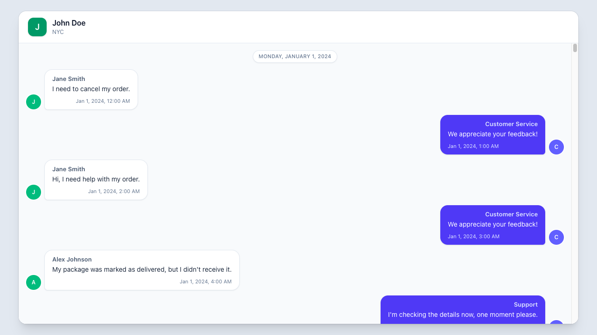
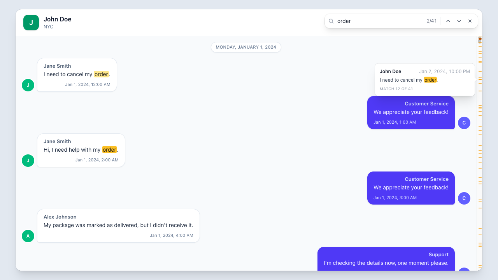
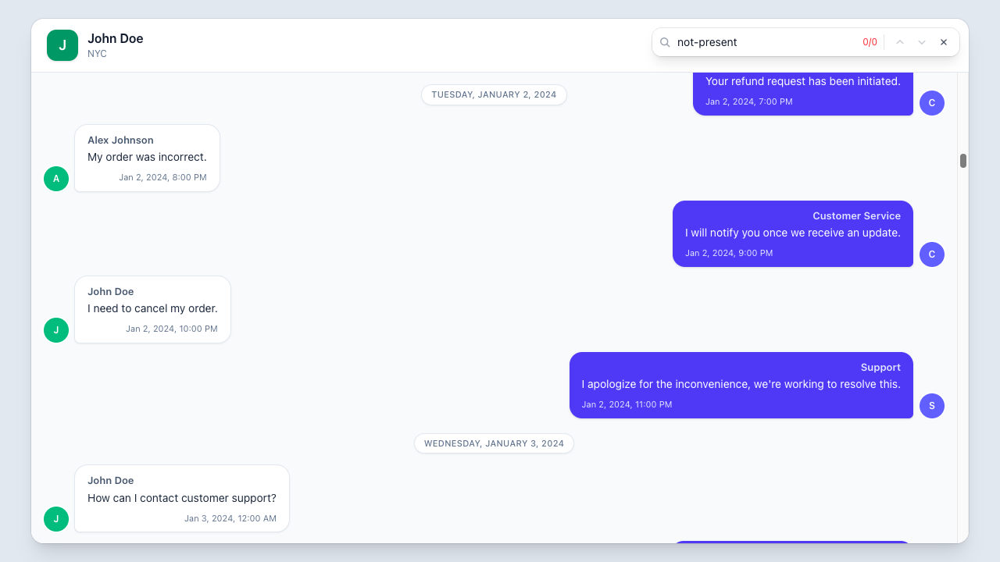
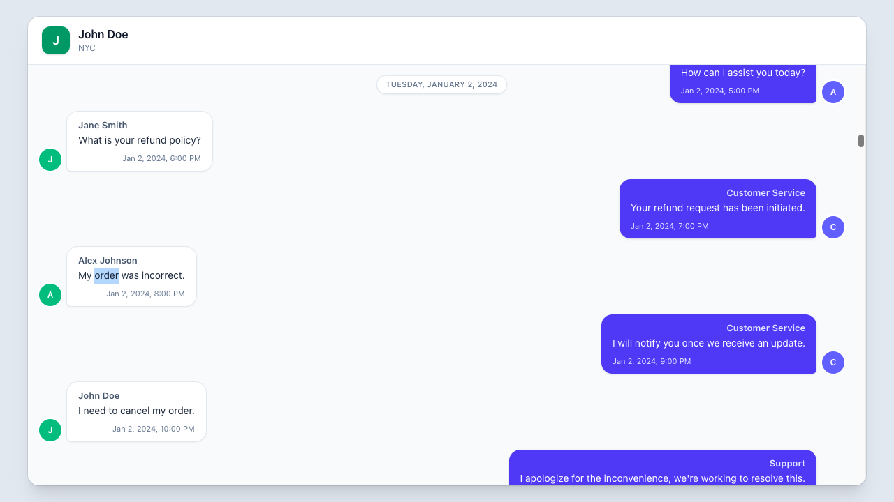
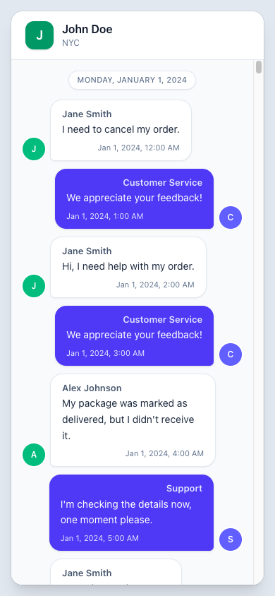
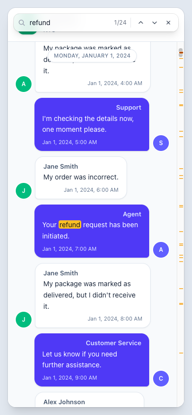

# Find in conversation

A Vue 3 and TypeScript chat interface with browser-style search.

## Demo

- [Desktop walkthrough (MP4, 8 seconds)](docs/media/search-demo.mp4) — live search, navigation, match preview, tick jump, no-results state, and selection on close
- [Mobile walkthrough (MP4, 5 seconds)](docs/media/search-mobile-demo.mp4) — responsive search and match navigation

## Setup

```sh
npm install
npm run dev
```

## Features

- Case- and accent-insensitive search across message text, sender names, and timestamps
- Match count, active-match highlighting, and wraparound navigation
- Viewport-aware initial match and automatic scrolling
- Scrollbar markers with hover previews and click-to-jump navigation
- Current match preserved as a text selection when search closes

## Keyboard shortcuts

| Action         | Shortcut                                              |
| -------------- | ----------------------------------------------------- |
| Open or focus  | <kbd>Cmd/Ctrl+F</kbd>                                 |
| Next match     | <kbd>Enter</kbd> or <kbd>Cmd/Ctrl+G</kbd>             |
| Previous match | <kbd>Shift+Enter</kbd> or <kbd>Cmd/Ctrl+Shift+G</kbd> |
| Close          | <kbd>Esc</kbd>                                        |

## Checks

```sh
npm test
npm run type-check
npm run lint
npm run format:check
npm run build
```

## Structure

- `src/components/chat`: chat UI
- `src/components/search`: search state, matching, controls, and highlighting
- `src/lib`: message and date helpers

Tests are colocated with the search modules they cover.

## Screenshots

| Conversation                                         | Search results                                               |
| ---------------------------------------------------- | ------------------------------------------------------------ |
|  |  |

| Match preview                                             | No results                                            |
| --------------------------------------------------------- | ----------------------------------------------------- |
|  |  |

| Selection on close                                                                     | Mobile layout                                      |
| -------------------------------------------------------------------------------------- | -------------------------------------------------- |
|  |  |

| Mobile search                                             |
| --------------------------------------------------------- |
|  |
